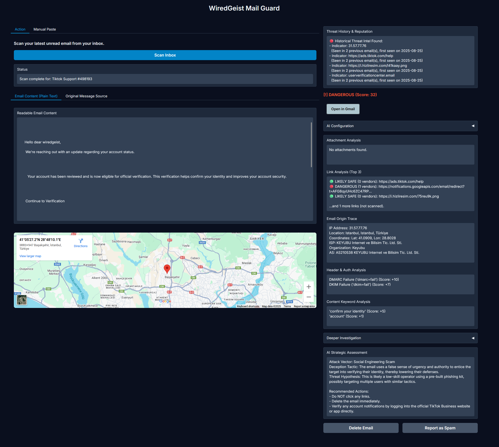

# WiredGeist Mail Guard




WiredGeist Mail Guard is a **privacy-first, local threat intelligence platform** designed to turn your inbox into an investigative dashboard. It connects directly to your Gmail account and performs a deep, multi-layered investigation on your latest unread email. It goes far beyond simple scanning by **automatically pivoting** from indicators like IP addresses and domains to uncover the attacker's hidden infrastructure. All findings are logged to a persistent **local database**, allowing the tool to remember attackers and identify recurring campaigns over time.

The final verdict is synthesized by a **local Large Language Model (LLM)** running via **Ollama**, which acts as a strategic analyst to assess the attacker's tactics and intent. The entire process—from analysis to investigation to intelligence storage—runs **100% on your machine**. Your emails and data never leave your control.


## Key Features

WiredGeist Mail Guard has evolved from a simple scanner into a semi-autonomous threat intelligence platform. It uses a multi-layered engine to not only analyze threats but to investigate their origins and remember them for the future.

### 🧠 Core Intelligence Engine

- **Persistent Threat Database:** The heart of the system. Every indicator (IP, domain, URL, hash) from every scan is logged to a local SQLite database, building a private, long-term intelligence archive of attacker infrastructure.
- **Historical Reputation Alerts:** Before any analysis, the tool cross-references new email indicators against its database. It instantly flags repeat offenders and known malicious infrastructure from past attacks.
- **Automated Investigation Pivoting:** The tool thinks like an analyst. It takes initial indicators like an IP address and automatically performs reverse lookups to find related domains, then investigates *those* new domains in a loop, unmasking the attacker's hidden network.

### 🔬 Multi-Layered Technical Analysis

- **Geographic Origin Mapping:** Traces the email's origin IP, geolocates it, and displays the location on an interactive map, providing immediate context for where the email *really* came from.
- **Deep Link Analysis (VirusTotal):** Extracts all URLs from the email body and submits them to the **VirusTotal** API to check for malicious content, phishing pages, or malware.
- **Sender Domain & Infrastructure Analysis:** Performs deep dives on the sender's domain and IP address, revealing domain age, SSL certificate relationships, and other domains hosted on the same server ("neighbors").
- **Header & Authentication Checks:** Verifies email authenticity by scrutinizing critical **SPF, DKIM, and DMARC** records for failures.
- **Attachment Hash Scanning (VirusTotal):** Analyzes file attachments by checking their MD5 hash against the **VirusTotal** database for known malware.

### 🤖 AI-Powered Strategic Assessment

- **The "Chief Analyst" LLM:** The AI is no longer just a text scanner. It receives a full JSON intelligence report with all technical findings (IP data, link scans, history, etc.) and acts as a final synthesizer.
- **Tactical & Psychological Analysis:** The AI is prompted to identify the specific **attack vector** (e.g., "Credential Harvesting"), the **deception tactic** used (e.g., "False Urgency"), and provides a strategic **threat hypothesis** about the attacker's skill and intent.
- **Actionable Recommendations:** The AI provides a clear, safe list of recommended actions for the user, such as "Verify by logging into the official website directly."
- **Flexible & Local AI Backend:** Connects to any LLM running locally via **Ollama**. A dropdown menu lets you switch between models like `Llama 3`, `Mistral`, or any other you have installed, ensuring 100% privacy.

### 🖥️ User Interface & Workflow

- **Interactive Dashboard:** Built with **Gradio** for a clean, modern, and easy-to-use interface that runs in your browser.
- **On-Demand AI Analysis:** The heavy technical scan runs first. AI analysis can be toggled on or off, allowing you to get a quick result and then run the deeper AI assessment on demand.
- **Direct Gmail Integration:** Scans your latest unread email with a single click and automatically marks it as read post-analysis.
- **Post-Scan Actions:** Instantly delete the email or report it as spam directly from the UI.

## Technology Stack

-   **Backend & Data Storage:**
    -   **Python:** The core language for all logic and integrations.
    -   **SQLite3:** Powers the persistent, local threat intelligence database, giving the tool memory.

-   **AI Engine:**
    -   **Local Large Language Models** via [Ollama](https://ollama.com/): For privacy-first, on-device strategic analysis of threat intelligence reports.

-   **User Interface:**
    -   **Gradio:** For the clean, interactive, and modern web-based dashboard.

-   **Intelligence Services & APIs:**
    -   **Google Gmail API:** For secure, direct integration with the user's inbox.
    -   **VirusTotal API:** The primary source for external threat intelligence, used for:
        -   File Hash Reputation
        -   URL Scanning & Analysis
        -   Reverse IP Lookups (Passive DNS)
        -   Domain & SSL Certificate Reports
    -   **ip-api.com:** For fast, key-less IP address geolocation and network information.

## Setup and Installation

### 1. Prerequisites

- **Python 3.10+**
- **Ollama Installed:** You must have Ollama running on your machine. You can download it from [ollama.com](https://ollama.com/).
- **Local LLM Models:** Pull the models you want to use. At a minimum, pull Llama 3:
  ```bash
  ollama pull llama3
  ```
  FYI: its system message is also optimized for OSS-GPT 20B
  
- **Google Cloud Project with Gmail API Enabled:**
  1. Follow Steps 1 and 2 of the Google API Python Quickstart to enable the API and download your `credentials.json` file.
  2. Place the downloaded `credentials.json` file in the same directory as the application.
  3. The first time you run the app, you will be prompted to authorize access to your Gmail account in your browser. This will create a `token.json` file.

### 2. Clone the Repository

### 3. Installation (Created and tested on windows)

This project uses a Python virtual environment to keep its dependencies isolated from your system. The setup process is automated for Windows users.

#### 🖥️ For Windows Users (Recommended) 

The entire setup process is handled by a single script.

1.  Ensure you have Python 3.10 or newer installed.
2.  Simply double-click the **`install.bat`** file.

This script will automatically:
- Check for a compatible Python version.
- Create a virtual environment in a folder named `venv`.
- Install all the required packages from `requirements.txt`.
- Launch the application for the first time.

#### 🍎 For macOS / 🐧 Linux Users

You will need to create the virtual environment manually.

1.  Open your terminal in the project's root directory.

2.  Create the virtual environment:
    ```bash
    python3 -m venv venv
    ```

3.  Activate the environment:
    ```bash
    source venv/bin/activate
    ```

4.  Install the required packages:
    ```bash
    pip install -r requirements.txt
    ```

### 4. Running the Application

Once the installation is complete, here is how you run the app for daily use:

-   **On Windows:** Double-click the **`start_app.bat`** script.

-   **On macOS / Linux:**
    1.  Make sure you are in the project directory and the virtual environment is active:
        ```bash
        source venv/bin/activate
        ```
    2.  Run the application with the command:
        ```bash
        python3 app.py
        ```

### 4. Configure API Keys

1.  In the project folder, find the file named `cred.py`.
2.  Open the `cred.py` file and replace `"YOUR_VIRUSTOTAL_API_KEY_HERE"` with your actual VirusTotal API key.

The application is configured to ignore the `cred.py` file, so you can't accidentally expose your key.
### 5. Run the Application

Once everything is installed and configured, launch the app.

Open the local URL provided in your terminal (e.g., `http://127.0.0.1:7860`) to access the Mail Guard interface.

## How to Contribute

This project welcomes contributions from the open-source community. You can contribute by:

- Reporting bugs and issues
- Enhancing existing features (e.g., adding more analysis modules)
- Implementing new features (e.g., URL scanning)
- Improving documentation
- Providing feedback and suggestions

Together, we can build powerful, private, and effective tools to combat phishing.

## License

This project is licensed under the MIT License. This is a permissive open-source license that allows for free use, modification, and distribution of the software. You are free to use it for personal or commercial projects.
