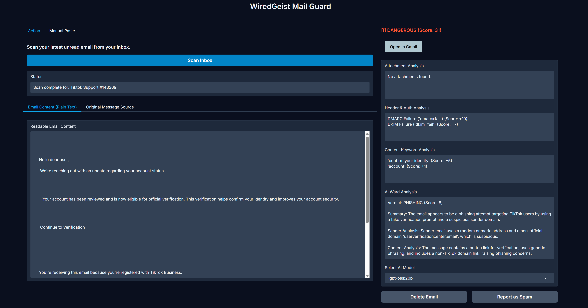
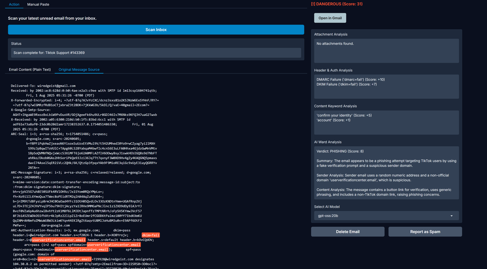

# WiredGeist Mail Guard




WiredGeist Mail Guard is a smart, locally-run email security tool designed to protect your inbox from phishing attacks. It connects directly to your Gmail account, fetches your latest unread email, and performs a multi-layered analysis using traditional methods and the power of local Large Language Models (LLMs) via Ollama.

The entire analysis is performed on your machine, ensuring your privacy.




## Key Features

- **Direct Gmail Integration:** Scans your latest unread email with a single click, automatically marking it as read after analysis.
- **Multi-Layered Analysis Engine:** Your email is scrutinized by a pipeline of security modules for a comprehensive verdict:
  - **Header & Authentication Analysis:** Checks for critical security failures in **SPF, DKIM, and DMARC** records to verify the sender's authenticity.
  - **Attachment Hash Analysis:** Extracts attachment hashes and checks them against the **VirusTotal** database for known malware.
  - **Content & Keyword Scanning:** Analyzes the email body for common phishing keywords, urgency triggers, and suspicious phrases.
  - **Local LLM-Powered AI Analysis:** This is the core of the tool. The email content is sent to a local LLM running via **Ollama** for a sophisticated verdict.
- **Flexible AI Backend:** A dropdown menu allows you to choose which locally installed Ollama model you want to use for the analysis, from `llama3` to specialized reasoning models.
- **Interactive Web Interface:** Built with **Gradio** for a clean, modern, and easy-to-use interface that runs in your browser.
- **Manual Analysis:** Provides a "Manual Paste" tab where you can paste the raw source of any email for an instant analysis.
- **Post-Scan Actions:** After an email is analyzed, you can immediately delete it or report it as spam directly from the app's interface.

## Technology Stack

- **Backend:** Python
- **AI:** Local Large Language Models via [Ollama](https://ollama.com/)
- **Web UI:** [Gradio](https://www.gradio.app/)
- **Email Service:** Google Gmail API
- **Threat Intelligence:** VirusTotal API (for attachments)

## Setup and Installation

### 1. Prerequisites

- **Python 3.10+**
- **Ollama Installed:** You must have Ollama running on your machine. You can download it from [ollama.com](https://ollama.com/).
- **Local LLM Models:** Pull the models you want to use. At a minimum, pull Llama 3:
  ```bash
  ollama pull llama3
  ```
- **Google Cloud Project with Gmail API Enabled:**
  1. Follow Steps 1 and 2 of the Google API Python Quickstart to enable the API and download your `credentials.json` file.
  2. Place the downloaded `credentials.json` file in the same directory as the application.
  3. The first time you run the app, you will be prompted to authorize access to your Gmail account in your browser. This will create a `token.json` file.

### 2. Clone the Repository

### 3. Install Dependencies

It's recommended to use a virtual environment.

(You will need to create a `requirements.txt` file containing `gradio`, `google-api-python-client`, `google-auth-httplib2`, `google-auth-oauthlib`, and `ollama`)

### 4. Configure API Keys

Create a file named `cred.py`.

Inside `cred.py`, add your VirusTotal API key.

### 5. Run the Application

Once everything is installed and configured, launch the app.

Open the local URL provided in your terminal (e.g., `http://127.0.0.1:7860`) to access the Mail Guard interface.

## How to Contribute

This project welcomes contributions from the open-source community. You can contribute by:

- Reporting bugs and issues
- Enhancing existing features (e.g., adding more analysis modules)
- Implementing new features (e.g., URL scanning)
- Improving documentation
- Providing feedback and suggestions

Together, we can build powerful, private, and effective tools to combat phishing.

## License

This project is licensed under the MIT License. This is a permissive open-source license that allows for free use, modification, and distribution of the software. You are free to use it for personal or commercial projects.
